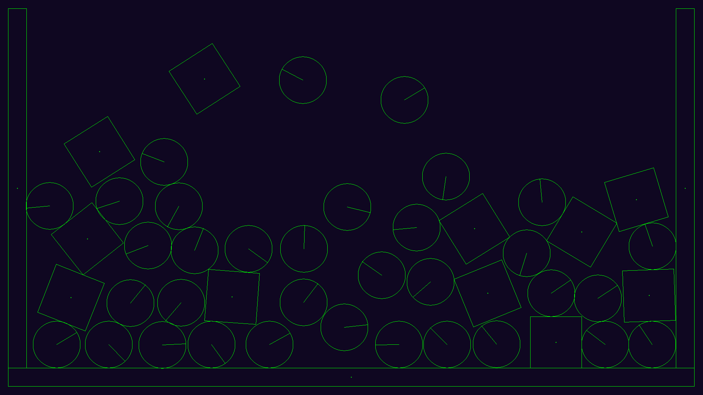
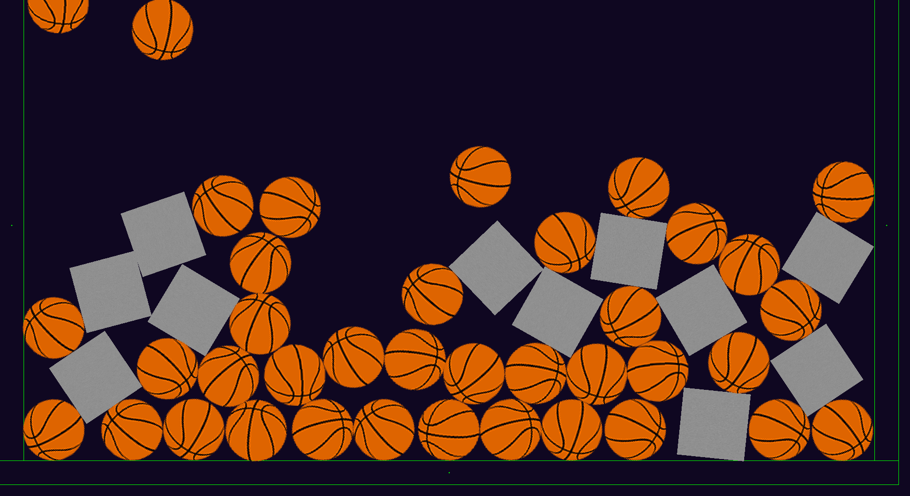
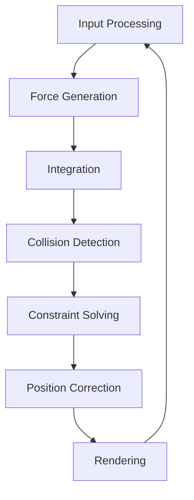

# 2D Physics Engine

A comprehensive 2D physics simulation engine built with C++ and SDL2, featuring rigid body dynamics, collision detection, and constraint solving.


## Screenshots





## 🚀 Features

### Core Physics

- **Rigid Body Dynamics**: Full 6-DOF physics simulation with linear and angular motion
- **Multiple Shape Types**: Support for circles, boxes, and custom polygons
- **Collision Detection**: Efficient narrow-phase collision detection with SAT algorithm
- **Collision Response**: Realistic collision resolution with restitution and friction
- **Constraint Solving**: Joint constraints and contact constraints using iterative methods

### Rendering & Graphics

- **SDL2 Integration**: Cross-platform graphics rendering
- **Texture Support**: Sprite rendering with rotation and scaling
- **Debug Visualization**: Wireframe rendering for physics debugging
- **Smooth Animation**: VSync and frame-rate independent physics

### Performance & Optimization

- **Efficient Memory Management**: Smart pointers and RAII principles
- **Optimized Algorithms**: Spatial partitioning ready architecture
- **Cross-Platform**: Native builds for Windows, Linux, and macOS

## 📋 Table of Contents

- [Installation](#-installation)
- [Building](#-building)
- [Usage](#-usage)
- [API Documentation](#-api-documentation)
- [Examples](#-examples)
- [Architecture](#-architecture)
- [Contributing](#-contributing)
- [License](#-license)

## 🛠 Installation

### Prerequisites

#### Windows

- **MinGW-w64** or **Visual Studio 2019+** with C++ support
- **SDL2 Development Libraries** (included in vendor/)
- **Make** (comes with MinGW-w64)

#### Linux (Ubuntu/Debian)

```bash
sudo apt-get update
sudo apt-get install build-essential cmake pkg-config
sudo apt-get install libsdl2-dev libsdl2-image-dev
```

#### Linux (Fedora/CentOS)

```bash
sudo dnf install gcc-c++ cmake make pkg-config
sudo dnf install SDL2-devel SDL2_image-devel
```

#### macOS

```bash
# Install Homebrew if not already installed
/bin/bash -c "$(curl -fsSL https://raw.githubusercontent.com/Homebrew/install/HEAD/install.sh)"

# Install dependencies
brew install cmake pkg-config sdl2 sdl2_image
```

### Quick Install

1. Clone the repository:

```bash
git clone https://github.com/your-username/2DPhysicsEngine.git
cd 2DPhysicsEngine
```

2. Build and run:

```bash
# Windows
build.bat

# Linux/macOS
./build.sh
```

## 🔧 Building

This project supports multiple build systems for maximum flexibility:

### Option 1: Make (Recommended)

#### Windows

```cmd
# Release build
make

# Debug build
make debug

# Clean and rebuild
make clean all

# Build and run
make run

# Show all available targets
make help
```

#### Linux/macOS

```bash
# Release build
make

# Debug build
make debug

# Clean and rebuild
make clean all

# Build and run
make run

# Install to system (requires sudo)
make install

# Show build information
make info
```

### Option 2: CMake (Advanced)

```bash
# Create build directory
mkdir build && cd build

# Configure (Release)
cmake -DCMAKE_BUILD_TYPE=Release ..

# Configure (Debug)
cmake -DCMAKE_BUILD_TYPE=Debug ..

# Build
cmake --build . --config Release

# Install
cmake --install .

# Create package
cpack
```

### Option 3: Build Scripts (Easiest)

#### Windows

```cmd
REM Basic build
build.bat

REM Debug build
build.bat debug

REM Clean and build
build.bat clean

REM Build and run
build.bat run
```

#### Linux/macOS

```bash
# Basic build
./build.sh

# Debug build with CMake
./build.sh --cmake --debug

# Clean and build
./build.sh --clean all

# Build and run
./build.sh run

# Show help
./build.sh --help
```

### Build Targets Explained

| Target    | Description                             |
| --------- | --------------------------------------- |
| `all`     | Build the main executable (default)     |
| `debug`   | Build with debug symbols and assertions |
| `release` | Build optimized for performance         |
| `clean`   | Remove all build artifacts              |
| `run`     | Build and execute the application       |
| `install` | Install to system directories           |
| `help`    | Show available build options            |
| `info`    | Display project and build information   |

## 🎮 Usage

### Basic Example

```cpp
#include "Application.h"

int main() {
    Application app;

    app.Setup();

    while (app.IsRunning()) {
        app.Input();
        app.Update();
        app.Render();
    }

    app.Destroy();
    return 0;
}
```

### Creating Physics Bodies

```cpp
#include "Physics/World.h"
#include "Physics/Body.h"
#include "Physics/Shape.h"

// Create a physics world with gravity
auto world = std::make_unique<World>(-9.8f);

// Create a circle body
auto circle = std::make_unique<Body>(
    std::make_unique<CircleShape>(50),  // radius = 50
    400, 300,                           // position (x, y)
    1.0f                               // mass
);
circle->restitution = 0.8f;  // bouncy
world->AddBody(std::move(circle));

// Create a static box (floor)
auto floor = std::make_unique<Body>(
    std::make_unique<BoxShape>(800, 50), // width, height
    400, 550,                            // position
    0.0f                                // mass = 0 (static)
);
world->AddBody(std::move(floor));
```

### Interactive Controls

| Input           | Action                      |
| --------------- | --------------------------- |
| **Left Click**  | Create basketball at cursor |
| **Right Click** | Create metal box at cursor  |
| **D Key**       | Toggle debug rendering      |
| **Escape**      | Exit application            |

### Runtime Examples

Run the built executable to see:

- **Bouncing Balls**: Click to create interactive physics objects
- **Realistic Physics**: Gravity, collision, and momentum conservation
- **Visual Feedback**: Real-time physics visualization

## 📚 API Documentation

### Core Classes

#### World Class

The main physics simulation manager.

```cpp
class World {
public:
    World(float gravity);

    void AddBody(std::unique_ptr<Body> body);
    void AddConstraint(std::unique_ptr<Constraint> constraint);
    void Update(float deltaTime);

    std::vector<std::unique_ptr<Body>>& GetBodies();
    std::vector<std::unique_ptr<Constraint>>& GetConstraints();
};
```

#### Body Class

Represents a rigid body in the physics simulation.

```cpp
struct Body {
    // Properties
    Vec2 position, velocity, acceleration;
    float rotation, angularVelocity;
    float mass, restitution, friction;
    std::unique_ptr<Shape> shape;

    // Methods
    Body(std::unique_ptr<Shape> shape, float x, float y, float mass);
    void AddForce(const Vec2& force);
    void AddTorque(float torque);
    void SetTexture(const char* filename);
    bool IsStatic() const;
};
```

#### Shape Classes

Define collision geometry for bodies.

```cpp
// Base shape interface
struct Shape {
    virtual ShapeType GetType() const = 0;
    virtual float GetMomentOfInertia() const = 0;
    virtual void UpdateVertices(float angle, const Vec2& position) = 0;
};

// Circle shape
struct CircleShape : public Shape {
    float radius;
    CircleShape(float radius);
};

// Box shape
struct BoxShape : public PolygonShape {
    float width, height;
    BoxShape(float width, float height);
};

// Custom polygon
struct PolygonShape : public Shape {
    std::vector<Vec2> vertices;
    PolygonShape(const std::vector<Vec2>& vertices);
};
```

#### Vec2 Class

2D vector mathematics utility.

```cpp
struct Vec2 {
    float x, y;

    Vec2(float x = 0, float y = 0);

    // Vector operations
    Vec2 operator+(const Vec2& other) const;
    Vec2 operator-(const Vec2& other) const;
    Vec2 operator*(float scalar) const;

    float Magnitude() const;
    float Dot(const Vec2& other) const;
    float Cross(const Vec2& other) const;
    Vec2 Normalize();
};
```

### Force Generators

```cpp
struct Force {
    static Vec2 GenerateDragForce(const Body& body, float k);
    static Vec2 GenerateFrictionForce(const Body& body, float k);
    static Vec2 GenerateGravitationalForce(const Body& a, const Body& b, float G);
    static Vec2 GenerateSpringForce(const Body& body, Vec2 anchor, float restLength, float k);
};
```

## 🎯 Examples

### Example 1: Basic Simulation

```cpp
#include "Physics/World.h"

int main() {
    auto world = std::make_unique<World>(-9.8f);

    // Create ground
    auto ground = std::make_unique<Body>(
        std::make_unique<BoxShape>(1000, 50),
        500, 575, 0.0f  // Static body
    );
    world->AddBody(std::move(ground));

    // Create falling ball
    auto ball = std::make_unique<Body>(
        std::make_unique<CircleShape>(25),
        500, 100, 1.0f
    );
    ball->restitution = 0.7f;
    world->AddBody(std::move(ball));

    // Simulate
    float dt = 1.0f / 60.0f;
    for (int i = 0; i < 1000; ++i) {
        world->Update(dt);
        // Render or log positions
    }

    return 0;
}
```

### Example 2: Chain of Bodies

```cpp
// Create a pendulum chain
Vec2 anchor(400, 50);
Body* prevBody = nullptr;

for (int i = 0; i < 5; ++i) {
    auto link = std::make_unique<Body>(
        std::make_unique<CircleShape>(15),
        anchor.x, anchor.y + i * 40,
        1.0f
    );

    Body* currentBody = link.get();
    world->AddBody(std::move(link));

    if (prevBody) {
        // Add distance constraint between bodies
        auto constraint = std::make_unique<DistanceConstraint>(
            prevBody, currentBody, 40.0f
        );
        world->AddConstraint(std::move(constraint));
    }

    prevBody = currentBody;
}
```

## 🏗 Architecture

### Project Structure

```
2DPhysicsEngine/
├── src/                    # Source files
│   ├── Main.cpp           # Application entry point
│   ├── Application.cpp    # Main application logic
│   ├── Graphics.cpp       # Rendering and SDL2 wrapper
│   ├── Math/              # Mathematical utilities
│   │   ├── Vec2.cpp       # 2D vector implementation
│   │   ├── VecN.cpp       # N-dimensional vectors
│   │   └── MatMN.cpp      # Matrix mathematics
│   ├── Physics/           # Physics engine core
│   │   ├── World.cpp      # Physics world manager
│   │   ├── Body.cpp       # Rigid body implementation
│   │   ├── Shape.cpp      # Collision shapes
│   │   ├── Force.cpp      # Force generators
│   │   ├── CollisionDetection.cpp  # Collision algorithms
│   │   └── Constraint.cpp # Constraint solver
│   └── SDL2Ext/          # SDL2 extensions
│       ├── SDL2_gfxPrimitives.c
│       ├── SDL2_imageFilter.c
│       └── SDL2_rotozoom.c
├── include/               # Header files
│   ├── Application.h
│   ├── Graphics.h
│   ├── Math/             # Math headers
│   │   ├── Vec2.h
│   │   ├── VecN.h
│   │   └── MatMN.h
│   ├── Physics/          # Physics headers
│   │   ├── World.h
│   │   ├── Body.h
│   │   ├── Shape.h
│   │   ├── Force.h
│   │   ├── Contact.h
│   │   ├── Constants.h
│   │   ├── CollisionDetection.h
│   │   └── Constraint.h
│   └── SDL2Ext/         # SDL2 extension headers
├── assets/              # Game assets
│   ├── basketball.png
│   ├── metal.png
│   └── angrybirds/     # Example assets
├── bin/                # Built executables
├── build/              # Build artifacts
├── lib/                # Static libraries
├── vendor/             # Third-party dependencies
│   └── SDL2/          # SDL2 development libraries
├── docs/              # Documentation
├── examples/          # Example projects
├── tests/             # Unit tests
├── cmake/             # CMake modules
├── Makefile           # Cross-platform Makefile
├── CMakeLists.txt     # CMake configuration
├── build.sh           # Linux/macOS build script
├── build.bat          # Windows build script
└── README.md          # This file
```

### Design Principles

1. **Modular Architecture**: Each component (physics, rendering, math) is independently developed
2. **Memory Safety**: Extensive use of RAII and smart pointers
3. **Cross-Platform**: Abstracted platform-specific code
4. **Performance**: Optimized algorithms for real-time simulation
5. **Extensibility**: Plugin-ready architecture for new features

### Physics Pipeline



## 🧪 Testing

### Running Tests

```bash
# Build and run tests
make tests

# Or with CMake
mkdir build && cd build
cmake -DENABLE_TESTS=ON ..
make && ctest
```

### Writing Tests

Create test files in the `tests/` directory:

```cpp
// tests/test_vec2.cpp
#include "Math/Vec2.h"
#include <cassert>

void test_vec2_addition() {
    Vec2 a(1, 2);
    Vec2 b(3, 4);
    Vec2 c = a + b;

    assert(c.x == 4);
    assert(c.y == 6);
}

int main() {
    test_vec2_addition();
    return 0;
}
```

## 🔧 Configuration

### Build Configuration

Edit `include/Physics/Constants.h` to modify simulation parameters:

```cpp
#ifndef CONSTANTS_H
#define CONSTANTS_H

const int FPS = 60;                    // Target framerate
const int MILLISECS_PER_FRAME = 1000 / FPS;
const float EPSILON = 0.005f;         // Floating-point precision
const int PIXELS_PER_METER = 50;      // Rendering scale
const int MAX_CONTACTS = 4;           // Contact points per collision

#endif
```

### Graphics Configuration

Modify `Graphics::OpenWindow()` for different window settings:

```cpp
// In Graphics.cpp
windowWidth = 1280;   // Custom width
windowHeight = 720;   // Custom height
// Or use fullscreen:
window = SDL_CreateWindow(NULL, 0, 0, windowWidth, windowHeight,
                         SDL_WINDOW_FULLSCREEN);
```

## 🐛 Troubleshooting

### Common Issues

#### Build Errors

**Problem**: `SDL2 not found` error  
**Solution**:

- **Linux**: Install SDL2 development packages
- **Windows**: Ensure SDL2 libraries are in `lib/` directory
- **macOS**: Install via Homebrew

**Problem**: `g++ not found`  
**Solution**: Install build tools for your platform

#### Runtime Issues

**Problem**: Application crashes immediately  
**Solution**:

1. Check if assets are in correct directory
2. Verify SDL2 runtime libraries are available
3. Run in debug mode: `make debug && ./bin/2DPhysicsEngine_debug`

**Problem**: Poor performance  
**Solution**:

1. Build in release mode: `make release`
2. Reduce number of physics bodies
3. Lower simulation resolution

#### Linking Issues

**Problem**: Undefined reference errors  
**Solution**:

1. Check library linking order in Makefile
2. Verify all source files are included in build
3. Update library paths for your system

### Debug Mode

Enable debug visualization and logging:

```cpp
// In Application.cpp
bool debug = true;  // Enable debug rendering

// Add logging
#ifdef DEBUG
    std::cout << "Body position: " << body->position.x << ", "
              << body->position.y << std::endl;
#endif
```

### Performance Profiling

Use built-in timing:

```bash
# Linux/macOS
time ./bin/2DPhysicsEngine

# Windows (PowerShell)
Measure-Command { ./bin/2DPhysicsEngine.exe }
```

## 🚀 Advanced Usage

### Custom Shapes

Create your own collision shapes:

```cpp
class TriangleShape : public PolygonShape {
public:
    TriangleShape(float base, float height) {
        vertices = {
            Vec2(-base/2, height/2),
            Vec2(base/2, height/2),
            Vec2(0, -height/2)
        };
    }

    ShapeType GetType() const override { return POLYGON; }
};
```

### Force Fields

Implement custom force generators:

```cpp
Vec2 MagneticForce(const Body& body, Vec2 fieldCenter, float strength) {
    Vec2 direction = fieldCenter - body.position;
    float distance = direction.Magnitude();

    if (distance < 0.01f) return Vec2(0, 0);

    return direction.Normalize() * (strength / (distance * distance));
}
```

### Integration Methods

Switch integration schemes:

```cpp
// In Body.cpp - Replace Euler with Verlet
void Body::IntegrateVerlet(float dt) {
    Vec2 newPosition = position * 2.0f - oldPosition +
                      acceleration * dt * dt;
    oldPosition = position;
    position = newPosition;
    velocity = (position - oldPosition) / dt;
}
```

## 🤝 Contributing

We welcome contributions! Please see our [Contributing Guidelines](CONTRIBUTING.md).

### Development Setup

1. Fork the repository
2. Create a feature branch: `git checkout -b feature-name`
3. Make your changes
4. Add tests for new functionality
5. Ensure all tests pass: `make tests`
6. Submit a pull request

### Code Style

- Use C++17 features
- Follow RAII principles
- Use smart pointers for memory management
- Comment complex algorithms
- Maintain consistent indentation (4 spaces)

### Reporting Issues

Please report bugs and feature requests on [GitHub Issues](https://github.com/your-username/2DPhysicsEngine/issues).

Include:

- Operating system and version
- Build configuration used
- Steps to reproduce the issue
- Expected vs actual behavior

## 📄 License

This project is licensed under the MIT License - see the [LICENSE](LICENSE) file for details.

```
MIT License

Copyright (c) 2024 2D Physics Engine

Permission is hereby granted, free of charge, to any person obtaining a copy
of this software and associated documentation files (the "Software"), to deal
in the Software without restriction, including without limitation the rights
to use, copy, modify, merge, publish, distribute, sublicense, and/or sell
copies of the Software, and to permit persons to whom the Software is
furnished to do so, subject to the following conditions:

The above copyright notice and this permission notice shall be included in all
copies or substantial portions of the Software.

THE SOFTWARE IS PROVIDED "AS IS", WITHOUT WARRANTY OF ANY KIND, EXPRESS OR
IMPLIED, INCLUDING BUT NOT LIMITED TO THE WARRANTIES OF MERCHANTABILITY,
FITNESS FOR A PARTICULAR PURPOSE AND NONINFRINGEMENT. IN NO EVENT SHALL THE
AUTHORS OR COPYRIGHT HOLDERS BE LIABLE FOR ANY CLAIM, DAMAGES OR OTHER
LIABILITY, WHETHER IN AN ACTION OF CONTRACT, TORT OR OTHERWISE, ARISING FROM,
OUT OF OR IN CONNECTION WITH THE SOFTWARE OR THE USE OR OTHER DEALINGS IN THE
SOFTWARE.
```

## 🙏 Acknowledgments

- **SDL2 Team**: For the excellent cross-platform multimedia library
- **Physics Community**: For algorithms and implementation techniques
- **Contributors**: All developers who have contributed to this project

## 📞 Support

- **Documentation**: [GitHub Wiki](https://github.com/your-username/2DPhysicsEngine/wiki)
- **Issues**: [GitHub Issues](https://github.com/your-username/2DPhysicsEngine/issues)
- **Discussions**: [GitHub Discussions](https://github.com/your-username/2DPhysicsEngine/discussions)

---

**Made with ❤️ by the 2D Physics Engine Team**
